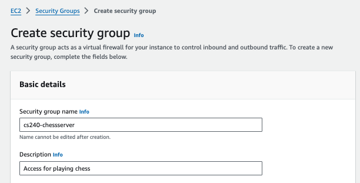
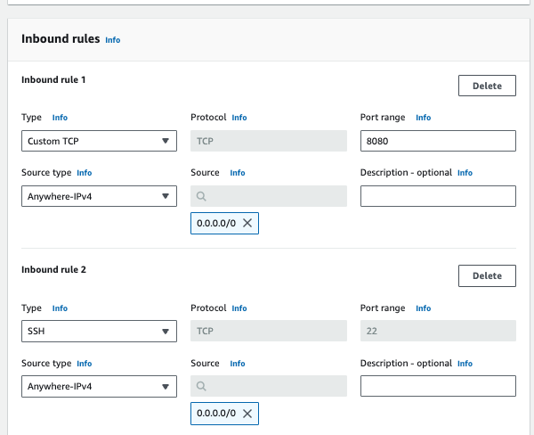
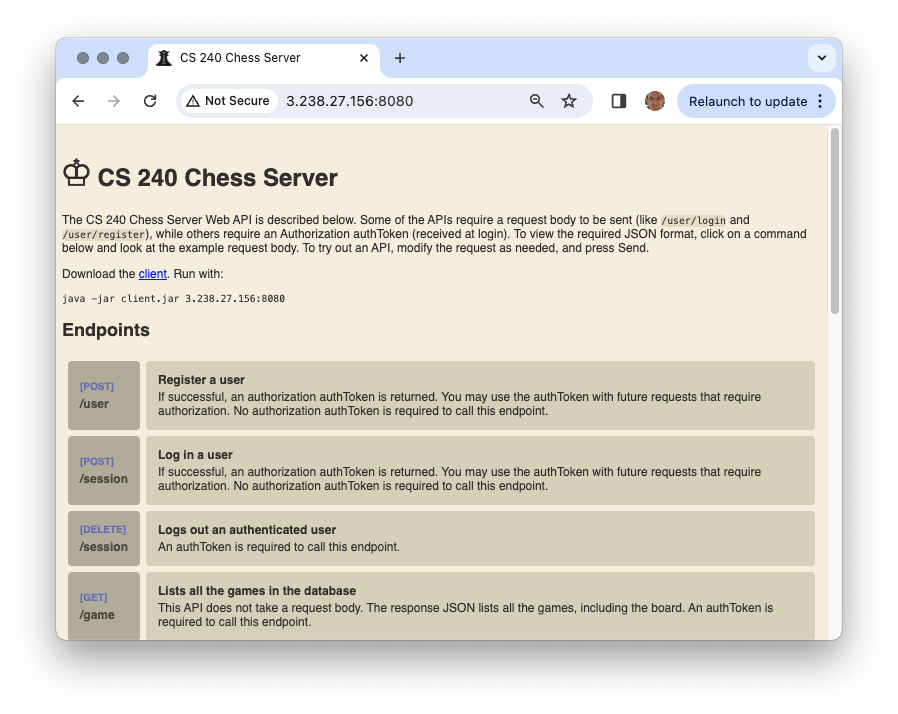
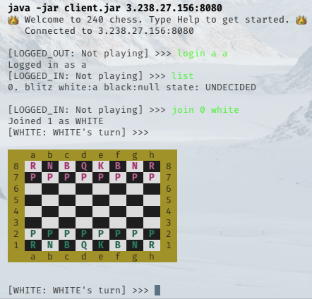

# AWS Chess Server

Playing chess in your development environment by yourself can get old after a while. Wouldn't it be nice if you could actually play with your friends or family? The great thing is that your code is already designed to allow any computer in the world to talk to your HTTP server, you just need to put it in a place where it is accessible. To do this, you need to run your chess server on a device that has a public IP address and open up your network port so that it is externally accessible.

There are lots of ways you can accomplish this. You could lease an IP address from your internet service provider (ISP) and assign it to your laptop, or you could lease a server from a cloud provider such as Digital Ocean, Azure, or Amazon Web Services (AWS).

In this instruction we will go with AWS. Note that there is a cost involved in renting a server from AWS. Although if you are careful it shouldn't cost more than $5 a month.

## Get AWS account

Go to [AWS](https://aws.amazon.com/) and register for an account if you don't already have one. You will need a credit card, but you won't be charged for anything until you start using their services. Make sure you are aware of the pricing model for anything that you use so that you don't get any unexpected surprises with your monthly bill.

## Launch an EC2 instance

The Amazon Elastic Compute Cloud (EC2) service provides all of the functionality you need to launch a virtual server in an Amazon data center that is accessible to the world. After you have created your AWS account, use the AWS browser console to navigate to the EC2 service and lease your server with the following steps.

1. From the search bar type in EC2 and select the displayed EC2 dashboard.
   
1. Create a security group

   1. The security group will expose the ability to talk to our server over HTTP on the server's network port. This is usually port 8080. From the EC2 dashboard select the `Security Group` view from the options on the left.
   1. Select the option to create a security group.
   1. Give it a meaningful name and description. Select the default VPC.
      
   1. In the `Inbound rules` section, create a rule that opens port 22 and port 8080 to everywhere.
      
   1. Save the security group.

1. Launch a server instance.

   1. Navigate back to the EC2 dashboard.
   1. Select the option to `Launch instance`.
   1. Give your instance a name like `cs240-chessserver`.
   1. Chose AWS linux for your Amazon Machine Image (AMI).
      
   1. Set the instance type of t2.micro. If you are eligible for the free tier then you will not be billing for the first 12 months of your first t2.micro instance.

      

   1. In the Key pair input select an existing key pair if you have created one previously, or select the `Create new key pair` option. Make sure you save the key pair to a safe place in your development environment. You will need this to connect to your server, and you do not want to let anyone else have access to it. Do not check the key pair into GitHub or any other publicly available location.
   1. In the `Network settings` you specify how the world can access your server. Choose the option to `Select existing security group` and pick the security group you created previously.

      

   1. Scroll past the remaining options and press `Launch instance`. This will display a message saying that the instance has been successfully launched. You can then navigate to the `Instances` view and click on your newly created server to see all of the details.

      

      You will want to copy the `Public IPv4 address` so that you can remotely connect to the server using a secure shell (SSH) and also access your server from the browser in order to play a game of chess.

## Install MySQL

Now that you have your AWS EC2 server up and running you need to install MySQL so that you can store your user and game information.

First you need to remotely connect to your server using a secure shell (SSH). Usually you do this by opening a console, or terminal, window in your development environment and typing the command `ssh`. In order to connect, you need the key pair you used to launch your server. The command looks like this:

```sh
ssh -i youkeypairhere.pem ec2-user@youripaddresshere
```

Once you have shelled into your EC2 server you can download, install, and start MySQL with the following commands.

```sh
sudo wget https://dev.mysql.com/get/mysql80-community-release-el9-1.noarch.rpm
sudo dnf install mysql80-community-release-el9-1.noarch.rpm -y
sudo rpm --import https://repo.mysql.com/RPM-GPG-KEY-mysql-2023
sudo dnf install mysql-community-client -y
sudo dnf install mysql-community-server -y
sudo systemctl start mysqld
```

When MySQL was installed it created a random password for the root user. You can get the password from the MySQL log file and use that to login to the MySQL client and change the password.

```sh
sudo grep 'temporary password' /var/log/mysqld.log
mysql -u root -p
ALTER USER 'root'@'localhost' IDENTIFIED BY 'yourpassword';
```

If your password is not complicated enough for the default MySQL password checker, you can disable the checker, but first you must change the password to something that is acceptable.

```sh
ALTER USER 'root'@'localhost' IDENTIFIED BY '1Really~Complicated!!';
UNINSTALL COMPONENT 'file://component_validate_password';
ALTER USER 'root'@'localhost' IDENTIFIED BY 'monkeypie';
```

## Install Java

Use the following to install the latest version of Java on your EC2 server.

1.  SSH into server as described above
1.  Install java `sudo dnf install java`
1.  Check that Java is running with `java --version`

## Modify your client code

You may need to modify your Chess Client code so that you can specify the server that it connects to. The following are two possible changes you might make.

1.  Make it so your chess client can take the `youripaddresshere:port` as a parameter.
    ```java
        public static void main(String[] args) {
            var serverName = args.length > 0 ? args[0] : "localhost:8080";
            ChessClient client = new ChessClient(serverName);
            // ...
        }
    ```
1.  Modify your web/index.html so your user can download your java client
    ```html
    <p>Download the <a href="client.jar">client</a>. Run with:</p>
    <pre>java -jar client.jar <span id="hostname">server</span>:8080</pre>
    <script>
      document.querySelector('#hostname').innerText = window.location.hostname;
    </script>
    ```

## Build the client and server jars

Build the client Jar and copy it to your server's resources web directory so that it can be downloaded from the server when someone wants to play chess.

```sh
mvn package -pl client -DskipTests
cp client/target/client-jar-with-dependencies.jar server/src/main/resources/web/client.jar
```

Now we can build the server jar.

```sh
mvn package -pl server -DskipTests
```

This will create the following `server/target/server-jar-with-dependencies.jar`

## Copy server code

With the server and client built, we can copy the server jar up to the EC2 server using the secure copy utility `scp`.

```sh
scp -i youkeypairhere.pem server/target/server-jar-with-dependencies.jar ec2-user@youripaddresshere:server.jar
```

## Start up the server

Now you are ready to start up the server.

1. SSH into server as described above
1. Run your server using the Java runtime and your server.jar

```sh
java -jar server.jar
```

This should output that the server is successfully running on the assigned port. Now you should be able to open up a browser on any computer in the world and see the web interface for your chess server. When you open your browser, put the public IP address and port number of your EC2 Instance. This should be something like `http://youripaddresshere:8080`.



You can then click the link that you created to download the client. Note that you may need to tell your browser to load your web page even though it is not secure, as well as specifying that you want to download the jar file.


Now you can use the Java runtime to run your chess client. Make sure you provide the ip address and port number as parameters.

```sh
java -jar client.jar youripaddress:8080
```



Have fun! You have just taken the first step in becoming the world's best chess server.
